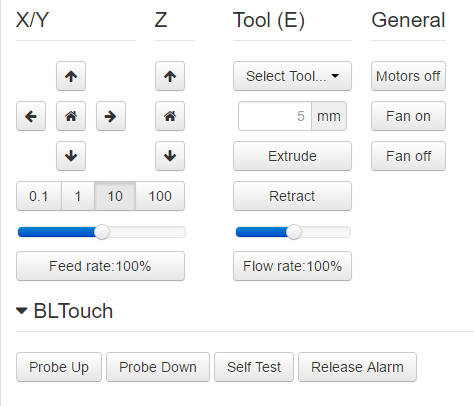

# OctoPrint-BLTouch-Klipper

*This Plugin is a fork of jneilliii 's "OctoPrint-BLTouch" to be better suited for Klipper*

A simple plugin to add buttons on the control tab to manage BLTouch. This plugin does not do auto bed leveling or utilize your BLTouch in any way to probe your mesh. It is just a utility plugin that adds buttons to the control tab that allows you to send the required GCODE commands to your printer to interact with the BLTouch probe. If you are looking for what those commands should be you should check the [manual](https://www.antclabs.com/manual) for the version of BLTouch that you have.

## Setup

Install manually using this URL:

    https://github.com/githubincuser/OctoPrint-BLTouch-Klipper/archive/master.zip

## Settings

## Get Help

If you experience issues with this plugin or need assistance please use the issue tracker by clicking issues above.

### Additional Plugins

Check out jneiliii 's other plugins [here](https://plugins.octoprint.org/by_author/#jneilliii)

## Support jneiliii 's Efforts
If you would like to support the programmer that built this plugin (jneilliii) to help them develop further plugins

[Patreon](https://www.patreon.com/jneilliii)
[PayPal](https://paypal.me/jneilliii)
